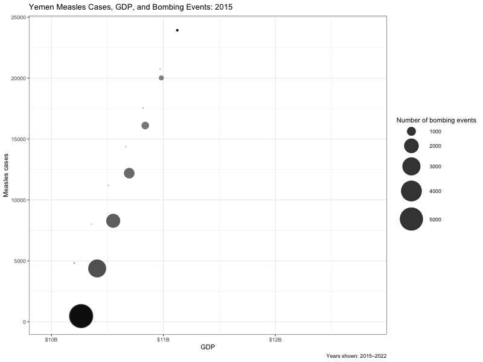

```{r}
#| label: load-packages
library(tidyverse)
library(gt)
library(httr)
library(tidyjson)
library(jsonlite)
library(rvest)
library(here)
library(broom)
library(ggridges)
library(scales)
library(leaflet)
library(gganimate)
library(scales)
library(gifski)

cases_month <- readr::read_csv('https://raw.githubusercontent.com/rfordatascience/tidytuesday/main/data/2025/2025-06-24/cases_month.csv')
cases_year <- readr::read_csv('https://raw.githubusercontent.com/rfordatascience/tidytuesday/main/data/2025/2025-06-24/cases_year.csv')

# need to do some cleaning for the webscraping process
cases_month2 <- cases_month |>
  mutate(month_abb = recode_values(month, 
                        1 ~ "Jan",
                        2 ~ "Feb",
                        3 ~ "Mar",
                        4 ~ "Apr",
                        5 ~ "May",
                        6 ~ "Jun",
                        7 ~ "Jul",
                        8 ~ "Aug",
                        9 ~ "Sep",
                        10 ~ "Oct",
                        11 ~ "Nov",
                        12 ~ "Dec"),
      country_scrape = str_to_lower(country),
      country_scrape = str_replace_all(country_scrape, " ", "-"))

api_load <- read.csv("./data/country_demographic.csv")
# load csv climate data
scraped_data <- read.csv(here("data", "weather-scrape.csv")) 

cases_month3 <- left_join(cases_month2, scraped_data, by = c("month_abb" = "month",  "country_scrape" = "country" ), 
                          relationship = "many-to-many")
meta_data <- left_join(cases_month3,
                       api_load,
                       by = c("country" = "name"),
                       relationship = "many-to-many")


```

```{css}
.question-card {
  background-color: #FFCC99;
}

.question-card .card-header {
  background-color: #FF9966;
  font-size: 1.25rem;
  font-weight: 600;
}

.question-text {
  font-size: 1.8rem;
  line-height: 1.35;
}
```

# World Analysis {orientation="rows" scrolling="true"}

```{r}

#| label: world-prep
#| include: false

richest_5 <- c("Singapore", "Ireland", "Luxembourg", "Norway", "Qatar")
poorest_5 <- c("Burundi", "Central African Republic", "South Sudan", "Yemen", "Mozambique")

timeseries_df <- meta_data |>
  mutate(
    date = make_date(year, month, 1),
  measles_per_100k = (measles_total / population) * 100000  ) |>
  filter(country %in% c(richest_5, poorest_5)) |>
  mutate(
    wealth_group = case_when(
      country %in% richest_5 ~ "Richest 5",
      country %in% poorest_5 ~ "Poorest 5"
    )
  )
```

## Row {.flow}

::: {.card .question-card title="Guiding Question" fill="false"}
<div class="question-text">
<strong>Which country-level factors are associated with higher measles rates?</strong>
</div>
:::

## Row {height="88%"}

### Column{width="55%"}

```{r}
#| fig-height: 8
#| fig-width: 15
#| title: "Worldwide Measles Cases in 2023"
#| fig-cap:  "This map shows measles cases per 100,000 people in 2023. Darker countries had higher population-adjusted measles rates. Countries are colored by measles cases per 100,000 people, making countries with different population sizes easier to compare."

library(leaflet)
library(sf)
library(tidyverse)
library(rnaturalearth)


measles_country <- cases_year |>
  filter(year == 2023) |>
  group_by(iso3, country) |>
  summarise(total_cases = sum(measles_total, na.rm = TRUE),
            total_population = mean(total_population, na.rm = TRUE),
            cases_per_100k = (total_cases / total_population) * 100000)


world <- ne_countries(scale = "medium", returnclass = "sf")

world_measles <- world |>
  left_join(measles_country, by = c("iso_a3" = "iso3"))

pal <- colorNumeric(
  palette = "YlOrRd",
  domain = world_measles$cases_per_100k,
  na.color = "#cccccc"
)


leaflet(world_measles) |>
  addProviderTiles(providers$CartoDB.Positron,
                   options = providerTileOptions(noWrap = TRUE)) |>
  setView(lng = 0, lat = 20, zoom = 2) |>
  setMaxBounds(lng1 = -180, lat1 = -85,
               lng2 = 180,  lat2 = 85) |>
  addPolygons(fillColor = ~pal(cases_per_100k),
              color = "black",
              weight = 0.35,
              opacity = 0.8,
              popup = ~paste0("<strong>", country, "</strong><br>",
                              "Cases: ", total_cases, "<br>",
                              "Population: ", total_population, "<br>",
                              "Cases per 100k: ", round(cases_per_100k, 3))) |>
  addLegend(pal = pal,
            values = ~cases_per_100k,
            title = "Cases per 100k",
            position = "bottomright")

```

### Column {width="45%"}


::: {.card title = "Mealses Rates and Economic Factors"}
This dashboard compares **measles incidence**, **GDP per capita**, and **population-adjusted case rates** across countries from 2012–2025.


```{r}
#| warning: false
library(scales)

meta_data |>
  group_by(country, year) |>
  summarise(annual_measles = sum(measles_total, na.rm=TRUE),
            gdp_per_capita = first(gdp_per_capita),
            region = first(region.x),
            .groups = "drop") |>
  group_by(country) |>
  summarise(mean_annual_measles = mean(annual_measles),
            gdp_per_capita = first(gdp_per_capita),
            region = first(region),
            .grpups = "drop") |>
  ggplot(aes(x = gdp_per_capita, y = mean_annual_measles)) +
  geom_hex(bins = 20) +
  scale_x_log10(labels = dollar_format()) +
  scale_y_log10(labels = comma_format()) +
  scale_fill_gradient(low = "blueviolet",
                      high = "goldenrod") +
  labs(
    title = "GDP per Capita vs Mean Annual Measles Cases by Country",
    x = "GDP per capita (log scale)",
    y = "Mean annual measles cases (log scale)",
    fill = "Number of Countries",
    alt = paste(
      "Hexbin plot of countries comparing GDP per capita and mean annual measles
      cases.",
      "Both axes are on log scale.",
      "Contries are concentrated along a negatively correlated line, with many 
      contries having low GDP and high measles cases, while many others have low
      measles cases and high GDP."
    )
  ) +
  theme_bw() 

```

:::

::: {.card title = "Country Rankings and GDP"}

::: {.panel-tabset}

#### Measles Cases

```{r}
country_measles <- meta_data |>
  group_by(country) |>
  summarize(avg_yearly_measles_cases = mean(measles_total, na.rm = TRUE),
            avg_population = mean(population, na.rm = TRUE)) |>
  mutate(cases_per_100k = (avg_yearly_measles_cases / avg_population) * 100000) |>
  filter(!is.na(cases_per_100k),
         is.finite(cases_per_100k),
         cases_per_100k != 0)

rank_type <- c("Highest", "Lowest")

get_rank <- function(rank_type) {
  if (rank_type == "Highest") {
    country_measles |>
      slice_max(cases_per_100k, n = 5, with_ties = FALSE) %>%
      mutate(group = "5 Highest Cases per 100,000")
  } else {
    country_measles |>
      slice_min(cases_per_100k, n = 5, with_ties = FALSE) %>%
      mutate(group = "5 Lowest Cases per 100,000")
  }
}

table_data <- map_dfr(rank_type, get_rank)

table_data |>
  gt(groupname_col = "group") |>
  cols_label(country = "Country",
             avg_yearly_measles_cases = "Avg. Yearly Measles Cases",
             avg_population = "Avg. Population",
             cases_per_100k = "Cases per 100,000 People") |>
  fmt_number(columns = c(avg_yearly_measles_cases,
                         avg_population,
                         cases_per_100k),
             decimals = 2) |>
  tab_header(title = "Countries with the Highest and Lowest Measles Cases per 100,000 People",
             subtitle = "Based on average yearly measles cases and average population") |>
  tab_style(style = cell_text(weight = "bold"),
            locations = cells_row_groups()) |>
  tab_style(style = cell_text(weight = "bold"),
            locations = cells_title()) |>
  tab_style(style = cell_text(weight = "bold"),
            locations = cells_column_labels()) |>
  tab_source_note(
    source_note = "Countries are ranked by average yearly measles cases per 100,000 people. The table compares the five countries with the highest rates and the five countries with the lowest rates.")
```

#### GDP per Capita

```{r}
gdppc_for_countries <- function(data, rich_countries, poor_countries) {
  data |>
    mutate(
      gdp_per_capita = (gdp / population) * 1000,
      group = case_when(
        country %in% rich_countries ~ "Richest 5",
        country %in% poor_countries ~ "Poorest 5")) |>
    filter(country %in% c(rich_countries, poor_countries)) |>
    group_by(group, country) |>
    arrange(desc(year), .by_group = TRUE) |>
    summarize(
      gdp_per_capita_usd = first(gdp_per_capita),
      .groups = "drop") |>
    arrange(group, desc(gdp_per_capita_usd)) |>
    gt(groupname_col = "group") |>
    fmt_currency(
      columns = gdp_per_capita_usd,
      currency = "USD",
      decimals = 0) |>
    cols_label(
      country = "Country",
      gdp_per_capita_usd = "GDP per Capita (USD)") |>
    tab_header(
      title = md("**GDP per Capita of Selected Richest and Poorest Countries**"),
      subtitle = "Countries grouped using GDP per capita rankings") |>
    tab_source_note(
      source_note = "GDP per capita was calculated as GDP divided by population.
      GDP appears to be stored in millions of USD, and population appears to be stored in thousands.") |>
    tab_options(table.width = pct(65))}

gdppc_for_countries(meta_data, richest_5, poorest_5)

```
:::
:::


# Yemen 


## Descriptions {width="50%"}

### Country Choice {height="50%"}
**Why Yemen?**    
Yemen is an **outlier** country with unusually high measles rates. In conjunction, their socio-economic history is complex, with synergistic conditions across access to healthcare, GDP and war. Over the last three years, they have ranked in the top 5 countries with the highest measles rates, while falling in the bottom 5 countries per GDP. Additionally, they have had a [civil war since 2014](https://www.britannica.com/event/Yemeni-Civil-War). Through this analysis, we aim to investigate the relationship between measles rates, GDP and civil war.

**Additional Data Sources**    

- [Worldometer](https://www.worldometers.info/gdp/yemen-gdp/) provides yearly GDP data from the World Bank and International Monetary Fund. The data is collected by WB and IMF through yearly reports and Worldometer contains GDP data for all of the world. The temporal availability of GDP depends on each country. For Yemen, Worldometer has published GDP data from 1990-2026. GDP is a critical measure for socio-economic conditions and is essential for evaluating the relationship between measles and economic status.      

- [Yemen Data Project](https://yemendataproject.org/data/) provides monthly aerial bombing data from 3/2015 - 4/2022 including locations, casualties and the number of bombs dropped. The data has been collected by the Yemen Data Project and is collected through open sources and cross-referenced using a wide range of information. These include local and international news agencies and media reports; social media accounts, including Twitter, Facebook, YouTube, and other video footage, and WhatsApp; reports from international and national NGOs; official records from local authorities; and reports by international human rights groups. This data is critical to highlighting the struggles of the people of Yemen.


### Map {height="50%"}

```{r}
leaflet() |>
  addProviderTiles("Esri.WorldStreetMap") |>
  setView(lng = 47.5, lat = 15.5, zoom = 5) |>
  setMaxBounds(lng1 = 40, lat1 = 11, lng2 = 56, lat2 = 20)

```


```{r}
#| label: yemen-data-prep
#| include: false

yemen <- meta_data |>
  filter(country == "Yemen") |>
  select(country, year, month, measles_total, rubella_total)

url <- "https://www.worldometers.info/gdp/yemen-gdp/"

result <- tryCatch({
  read_html(url)
}, error = function(e) {
  message("Failed to read GDP page: ", e$message)
  NULL
})

gdp_data <- result |>
  html_elements("table") |>
  html_table()

clean_me <- function(df) {
  df |>
    rename(GDP_USD = 2) |>
    select(Year, GDP_USD) |>
    mutate(
      GDP_USD = str_remove_all(GDP_USD, "\\$"),
      GDP_USD = str_remove_all(GDP_USD, ","),
      GDP_USD = as.numeric(GDP_USD)
    )
}

gdp_wb <- clean_me(as.data.frame(gdp_data[1]))

gdp_imf <- clean_me(as.data.frame(gdp_data[3])) |>
  filter(Year < 2014)

yemen_gdp <- bind_rows(gdp_wb, gdp_imf)

bomb <- read.csv("yemen-bombing.csv") |>
  mutate(
    Date = dmy(Date),
    month = month(Date),
    year = year(Date)
  ) |>
  group_by(month, year) |>
  summarize(
    bombing_events = n(),
    total_casualty = sum(Fatalities + Woman.fatalities, na.rm = TRUE),
    .groups = "drop"
  )

yemen_measles_yearly <- yemen |>
  group_by(year) |>
  summarize(
    measles_total = sum(measles_total, na.rm = TRUE),
    rubella_total = sum(rubella_total, na.rm = TRUE),
    .groups = "drop"
  )

yemen_yearly <- bomb |>
  group_by(year) |>
  summarize(
    bombing_events = sum(bombing_events, na.rm = TRUE),
    total_casualty = sum(total_casualty, na.rm = TRUE),
    .groups = "drop"
  ) |>
  right_join(yemen_measles_yearly, by = "year") |>
  left_join(yemen_gdp, by = c("year" = "Year"))
```

```{r}
#| label: save-yemen-bubble-gif
#| include: false
#| eval: false

yemen_bubble_plot <- yemen_yearly |>
  filter(year >= 2015, year <= 2022) |>
  ggplot(aes(
    x = GDP_USD,
    y = measles_total,
    size = bombing_events)) +
  geom_point(alpha = 0.8) +
  shadow_wake(
    wake_length = 0.4,
    alpha = TRUE,
    size = TRUE) +
  scale_x_continuous(
    labels = label_dollar(scale_cut = cut_short_scale())) +
  scale_size_continuous(
    range = c(3, 18),
    name = "Number of bombing events") +
  labs(
    title = "Yemen Measles Cases, GDP, and Bombing Events: {closest_state}",
    x = "GDP",
    y = "Measles cases",
    caption = "Years shown: 2015–2022") +
  theme_bw() +
  transition_states(
    year,
    transition_length = 15,
    state_length = 15)

anim <- animate(
  yemen_bubble_plot,
  nframes = 100,
  fps = 10,
  width = 800,
  height = 600,
  renderer = gifski_renderer())

anim_save("yemen_bubble_plot.gif", animation = anim)
```

## Plots

### Yemen Bubble Plot



